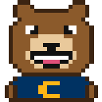

# Oski — don't let him die 🐻🩸

A tiny 8-bit **Oski** (the Cal bear) lives in the **top-right corner** of your browser. That's it. That's the
extension.

- **Work** in the browser and Oski is fine. If he was hurt, he slowly heals (about 90 minutes to full health).
- **Doomscroll** on YouTube, Instagram, Reddit, Twitter/X or Clash Royale sites and he gets hurt. First a black
  eye and a scratch, then bleeding, then bones showing, then he's barely twitching. **30 minutes** on those sites
  kills a healthy Oski.
- **Go idle** (no keyboard or mouse for a minute) and he fades too, more slowly: about 2 hours to die.
- **Switch to another app** (browser not focused) and nothing happens either way.
- When he dies he lies there grey with a fly on him. Click him (or the toolbar icon) to bring him back. He keeps
  count of how many times you've killed him.

No timers, no stats, no XP. Just keep him alive.

<p align="center"></p>

## Overview

Focusling turns time-boxed study into a progression loop. Starting a focus block deploys your companion into a real-time canvas arena where it auto-engages waves of hostiles; every minute of completed focus is converted into experience, and experience feeds a level curve that governs the companion's damage output, fire rate, projectile count, evolution stage and unlockable roster.

1. Download this repo (green *Code* button → *Download ZIP*) and unzip it, or `git clone` it.
2. Open `chrome://extensions`, switch on **Developer mode** (top right).
3. Click **Load unpacked** and pick the folder that **directly contains `manifest.json`**.
   ⚠ A GitHub ZIP unpacks into a folder *inside* a folder of the same name. Pick the inner one, otherwise
   Chrome says "Manifest file is missing or unreadable".
4. Pin Oski from the puzzle-piece menu.

**Firefox**: `about:debugging#/runtime/this-firefox` → **Load Temporary Add-on…** → pick `manifest.json`.

Click the toolbar icon once. A little window with Oski appears in the top-right corner of your screen and he
starts watching what you do. Oski also shows up in the top-right corner of every web page (so he bleeds right
there on YouTube). Hover him to see his health and what's hurting him.

## The gear

Hover Oski in his window and a small ⚙ appears. Behind it:

- the list of sites that hurt him (one per line; defaults are YouTube, Instagram, Reddit, Twitter, X,
  royaleapi.com, clashroyale.com, statsroyale.com, TikTok),
- whether to show him on every web page as well as in his window,
- desktop notifications at 50%, 20% and death,
- turn him off / reset.

The toolbar badge shows his health once he's hurt, `RIP` when he's dead, `off` when he's switched off.

## Notes

- The corner window is a normal browser window, so it can end up behind other windows. The on-page overlay
  is there so you still see him while browsing.
- Tracking uses the browser's idle detector and the active tab of the focused browser window. Nothing leaves
  your computer; state lives in `chrome.storage.local`.
- All the injuries are pixel-art patches in `oski.js` (`STAGES`). Rates are in `rules.js` (`RATES`).

## Project layout

```
manifest.json   MV3 manifest (Chrome service worker + Firefox event page)
rules.js        health rules — pure functions, unit-tested
background.js   watches tabs / focus / idle, charges time, notifications, badge, opens the window
oski.js         the sprite, the injury stages, and the animated renderer
window.html/js  the tiny corner window
overlay.js      content script: Oski in the corner of every page
test/           npm test
scripts/        make-icons.py (renders Oski to PNG), package.sh (zip for store upload)
```

## Development

```
npm test              # rules + sprite tests
npm run icons         # regenerate icons from the Oski sprite
npm run package       # dist/focusling.zip
```
